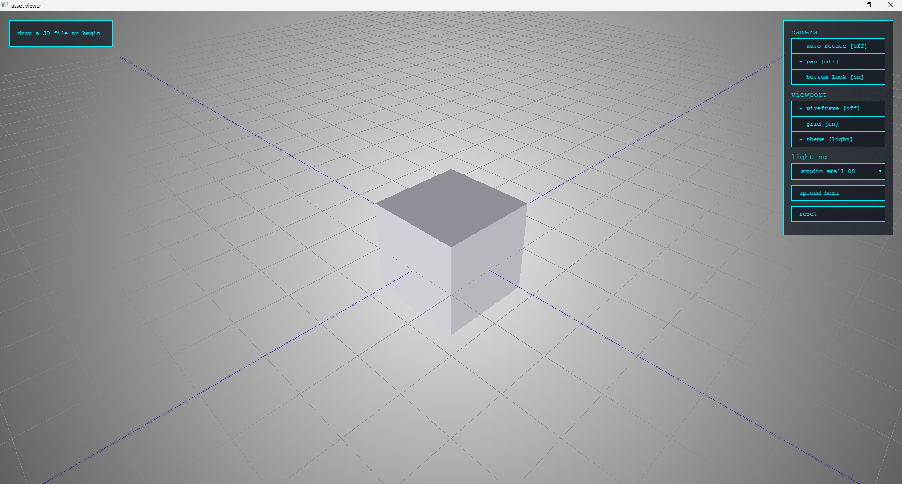

# asset-viewer

A lightweight 3D model viewer that runs locally.
Drop in a GLB, FBX, or OBJ and inspect it — no uploads, no accounts, no nonsense.



## features

- drag and drop model loading (GLB, GLTF, FBX, OBJ)
- mesh stats — objects, vertices, faces, triangles, file size
- HDRI lighting with built-in presets + custom upload
- orbit controls with auto-rotate, pan, bottom lock
- wireframe toggle, grid toggle, light/dark theme
- PyQt5 desktop app — runs as a standalone exe

## stack

- Three.js — 3D rendering
- Flask — local server
- PyQt5 + QWebEngine — desktop wrapper
- PyInstaller — exe packaging

## download

Grab the latest release from the [releases page](../../releases) — no Python required.

## run locally

```bash
pip install -r requirements.txt
python main.py
```

## build exe

```bash
pyinstaller --noconfirm --onedir --windowed --name "asset-viewer" --add-data "templates;templates" --add-data "static;static" --add-data "hdri;hdri" --add-data "models;models" main.py
```

exe will be in `dist/asset-viewer/`.